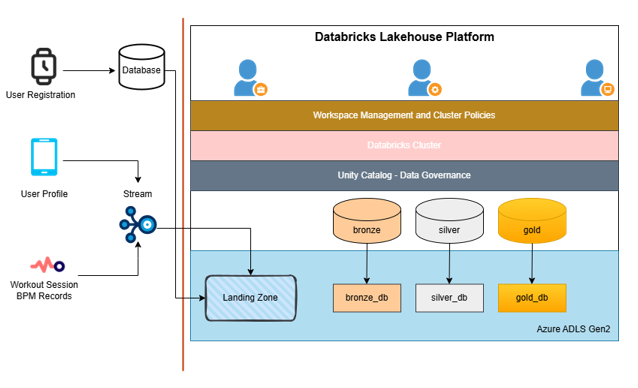
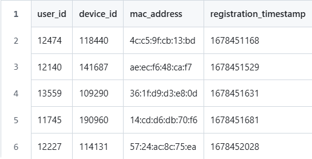
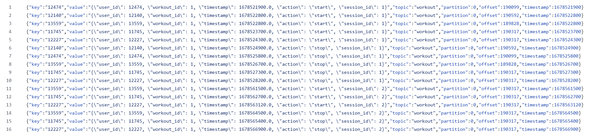
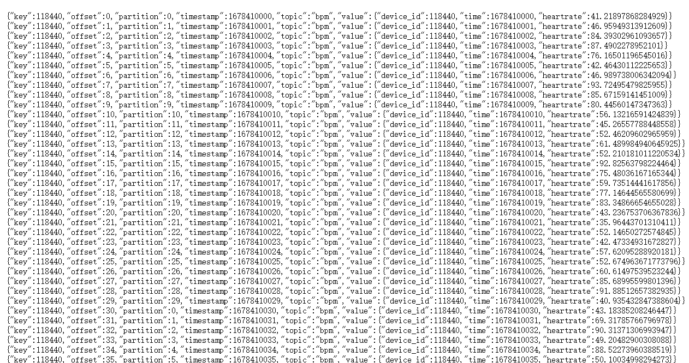

# Lakehouse-Project
Implementation of a Lakehouse Solution with Medallion Data Architecture



## Project Description
This project is about implementing Lakehouse solution for a wearable tech company (let's call it SBIT). SBIT produces smart watches that can monitor heart rate of the users so that they can evaluate their performance during the workouts in the gyms. Now we want to implement a Lakehouse solution for the company with medallion data architecture, collect and ingest data from data sources to the Lakehouse, and create reports for users in the below format:

*Workout BPM Summary*
|User id|Date|Workout id|Session id|Age|Sex|City|State|Min bpm|Avg bpm|Max bpm|
|:---|:---|:---|:---|:---|:---|:---|:---|:---|:---|:---|
|12140|2019-12-11|5|478|18-25|M|Pear blossom|CA|205|86.97|114.89|176.84
|12140|2019-12-12|6|479|18-25|M|Pear blosoom|CA|206|77.76|112.73|181.24

*Gym Summary*
|Gym|Mac Address|Date|Minutes in Gym|Minutes Exercising|
|:---|:---|:---|:---|:---|
|4|32:60:3b:80:ed:8e|2019-12-11|107.23|96.00|
|4|32:60:3b:80:ed:8e|2019-12-12|108.60|100.26|

Beyond these basic requirements, we also want to conduct some good practices in the project, including:

1. Decouple data integration from data procesing
2. Support batch and stream workflows
3. Govern structured and unstructured data with Unity Catalog

This project is inspired by [Prashant Kumar Pandey](https://www.linkedin.com/in/prashant-kumar-pandey), I try to provide a detailed explanation for it and the process of approaching the solution.

## Data Sources

**Relational Database**
- User Registration Table
- Gym Login Logout Info Table

**Kafka Topics**
- User Profile Update
- Heart Rate Stream
- Workout Session

To decouple operational workloads from our Lakehouse design, we assume that User Profile Update stream can query the User Registration Table, and there assumes to be a table in place to combine the login and logout events of users in gyms.

**Sample data**:

*User Registration*



*User Info*
```
{"key":"14633","value":"{\"user_id\": 14633, \"update_type\": \"new\", \"timestamp\": 1678538830.0, \"dob\": \"09/04/1997\", \"sex\": \"F\", \"gender\": \"F\", \"first_name\": \"Hannah\", \"last_name\": \"Fuller\", \"address\": {\"street_address\": \"81346 Obrien Streets\", \"city\": \"Gardena\", \"state\": \"CA\", \"zip\": 90249}}","topic":"user_info","partition":0,"offset":12848,"timestamp":1678538830}
{"key":"14508","value":"{\"user_id\": 14508, \"update_type\": \"new\", \"timestamp\": 1678539025, \"dob\": \"01/28/1936\", \"sex\": \"M\", \"gender\": \"M\", \"first_name\": \"Justin\", \"last_name\": \"Eaton\", \"address\": {\"street_address\": \"04952 Lori Plain\", \"city\": \"Sierra Madre\", \"state\": \"CA\", \"zip\": 91024}}","topic":"user_info","partition":0,"offset":12782,"timestamp":1678539025}
{"key":"13937","value":"{\"user_id\": 13937, \"update_type\": \"new\", \"timestamp\": 1678539037.0, \"dob\": \"04/26/1982\", \"sex\": \"M\", \"gender\": \"M\", \"first_name\": \"Matthew\", \"last_name\": \"Johnson\", \"address\": {\"street_address\": \"9231 Edward Throughway Suite 072\", \"city\": \"Toluca Lake\", \"state\": \"CA\", \"zip\": 91610}}","topic":"user_info","partition":0,"offset":12801,"timestamp":1678539037}
{"key":"14232","value":"{\"user_id\": 14232, \"update_type\": \"new\", \"timestamp\": 1678539087, \"dob\": \"01/04/1979\", \"sex\": \"M\", \"gender\": \"M\", \"first_name\": \"Edward\", \"last_name\": \"Simpson\", \"address\": {\"street_address\": \"92012 Bradley Shoals\", \"city\": \"Long Beach\", \"state\": \"CA\", \"zip\": 90815}}","topic":"user_info","partition":0,"offset":12771,"timestamp":1678539087}
{"key":"14232","value":"{\"user_id\": 14232, \"update_type\": \"update\", \"timestamp\": 1678539098.0, \"dob\": \"01/04/1979\", \"sex\": \"M\", \"gender\": \"M\", \"first_name\": \"Edward\", \"last_name\": \"Smith\", \"address\": {\"street_address\": \"41444 Noble Cape Suite 390\", \"city\": \"North Hollywood\", \"state\": \"CA\", \"zip\": 91606}}","topic":"user_info","partition":0,"offset":12829,"timestamp":1678539098}
{"key":"15149","value":"{\"user_id\": 15149, \"update_type\": \"new\", \"timestamp\": 1678539102, \"dob\": \"03/30/1972\", \"sex\": \"M\", \"gender\": \"M\", \"first_name\": \"Cameron\", \"last_name\": \"Vasquez\", \"address\": {\"street_address\": \"95932 Gary Ridges\", \"city\": \"Los Angeles\", \"state\": \"CA\", \"zip\": 90018}}","topic":"user_info","partition":0,"offset":12773,"timestamp":1678539102}
```

*Gym Login logout*


*Workout*



*BPM (heart rate)*




## Initial Project Design
Given the requirements mentioned earlier, below is the initial project design: 

Placeholder for the design.

As you can see the data ingestion process is decoupled from our Lakehouse Platform. But it also brings another question: how do we design our Lakehouse Storage? We do not want to expose the managed data under the table directories as well as the unmanaged data to the users, and we want to only grant the access to the bronze/silver/gold layer data to a certain group of users. Therefore, a proper storage design is critical. 

## Storage Design
In this project, ADLS Gen2 is selected as the storage layer as it is highly available and fault-tolerant. More importantly, it is highly compatible with Spark and Delta Lake. In this project, three containers are created: 

/sbit-metastore-root store the metadata of the metastore 

/sbit-managed-dev stores the managed databases and tables, and it is where we conduct the medallion architecture. 

/sbit-unmanaged-dev is the container storing the unmanaged data. 

And the storage design below enables the admin to have a fine-grained data access control.

Placeholder for storage plan.

/sbit-metastore-root is hidden from the users in the workspace. /sbit-managed-dev are only can be accessed to a certain group of developers. Normally users only access the data from the tables in those three layers.

## Data Modelling & Medallion Architecture
Data modelling is a critical part for Data Engineering Projects, but somehow neglected by many Data Engineers when they try to showcase their technical solutions. The tables will not be automatically created for us, and a good understanding of the data is a prerequisite for a good data modelling design. 

When I approach the problem of creating data models, I would start with a bi-directional method: starting from the raw data to the final output, meanwhile trying to figure out the requirements from the output of the final report tables. 
 
From the table Workout BPM Summary, it can be seen that there are several columns about users: user_id, age, gender, city, state. Since neither user nor user_profile contains all these info, there should be an intermediate table to join those tables in the Silver layer. The Workout BPM Summary table also contains info about workouts, but workouts table has to be processed to combine start time and end time info into one single table. And the last piece of info: BPM has to be connected to the user table with the device_id within a valid workout range. 
 
And the similar deduction process could be directly applied to the table Gym Summary. This one is relatively easier: a connection is needed between the Gym Login Logout table and table of processed intermediate table of workouts. 

Then we can conduct the Medallion Architecture. 

Medallion design

Bronze Layer do not process or transform the data, it directly extract from the landing zone. In the Silver Layer, transformation and joins are necessary so that they are ready in the next stage. Aggregation is where the aggregation occurred according to business user's requirements. Most of the time, we do not aggregate the tables in the Silver layer as granularity of data is critical if there are other requirements. 

## CDC (Change Data Capture)
It is noteworthy that there are two upsert methods adopted in this project to help us deal with "Change Data Capture". The user profile data is the only source that we want to retain the most up-to-date record. For the other tables, we only insert the records if there are new records identified on unknown key combinations. Below are some examples.

```
class Upserter: 
    def __init__(self, merge_query, temp_view_name): 
        self.merge_query = merge_query 
        self.temp_view_name = temp_view_name  

    def upsert(self, df_micro_batch, batch_id): 
        df_micro_batch.createOrReplaceTempView(self.temp_view_name) 
        df_micro_batch._jdf.sparkSession().sql(self.merge_query) 

query = f""" 
            MERGE INTO {self.catalog}.{self.db_name}.workouts a 
            USING workouts_delta b 
            ON a.user_id=b.user_id AND a.time=b.time 
            WHEN NOT MATCHED THEN INSERT * 
            """ 
```

```
class CDCUpserter: 
    def __init__(self, merge_query, temp_view_name, id_column, sort_by): 
        self.merge_query = merge_query 
        self.temp_view_name = temp_view_name  
        self.id_column = id_column 
        self.sort_by = sort_by  

    def upsert(self, df_micro_batch, batch_id): 
        from pyspark.sql.window import Window 
        from pyspark.sql import functions as F 
        window = Window.partitionBy(self.id_column).orderBy(F.col(self.sort_by).desc())

        df_micro_batch.filter(F.col("update_type").isin(["new", "update"])) \ 
                .withColumn("rank", F.rank().over(window)).filter("rank == 1").drop("rank") \ 
                .createOrReplaceTempView(self.temp_view_name) 

        df_micro_batch._jdf.sparkSession().sql(self.merge_query) 

query = f""" 
            MERGE INTO {self.catalog}.{self.db_name}.user_profile a 
            USING user_profile_cdc b 
            ON a.user_id=b.user_id 
            WHEN MATCHED AND a.updated < b.updated 
              THEN UPDATE SET * 
            WHEN NOT MATCHED 
              THEN INSERT * 
            """ 
```

## Batch and Stream
This project enables users to switch between batch processing and stream processing by the configuration of triggers. By configuring the value of "once" in the code, users can run the code in batch processing mode or stream processing mode based on their needs.

The code is written in the format of Databricks Notebooks. You can test the batch mode with the notebook 09-batch-test, or the stream mode with 10-stream-test.

## Summary
This project tries to propose a fault-tolerant and scalable Data Engineering Solution for SBIT. In the future, automated CI/CD can be added.


